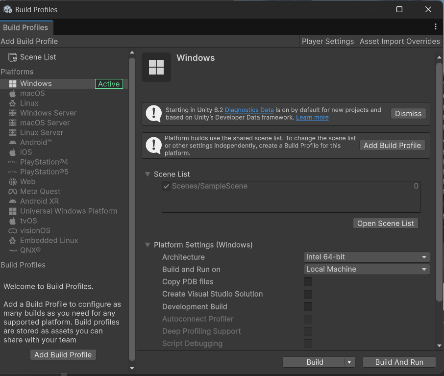
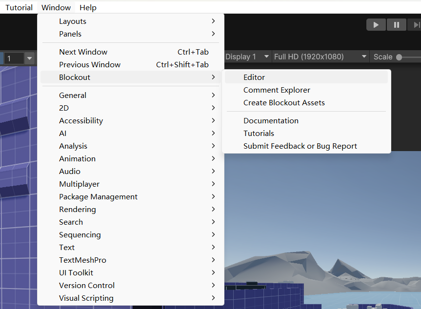
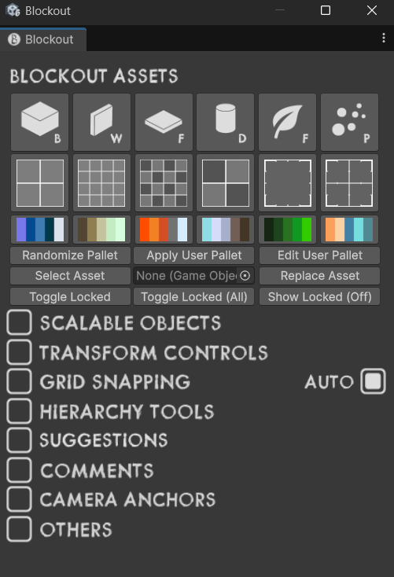
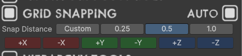
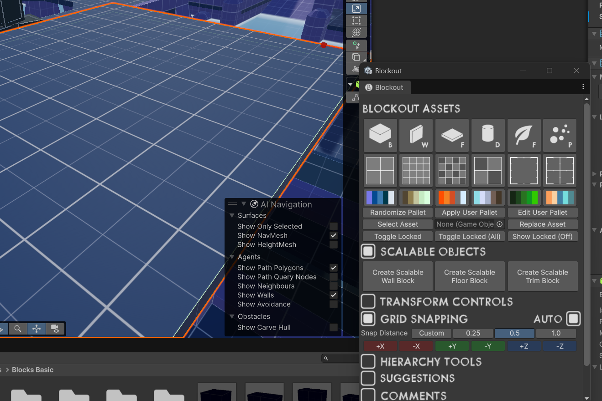
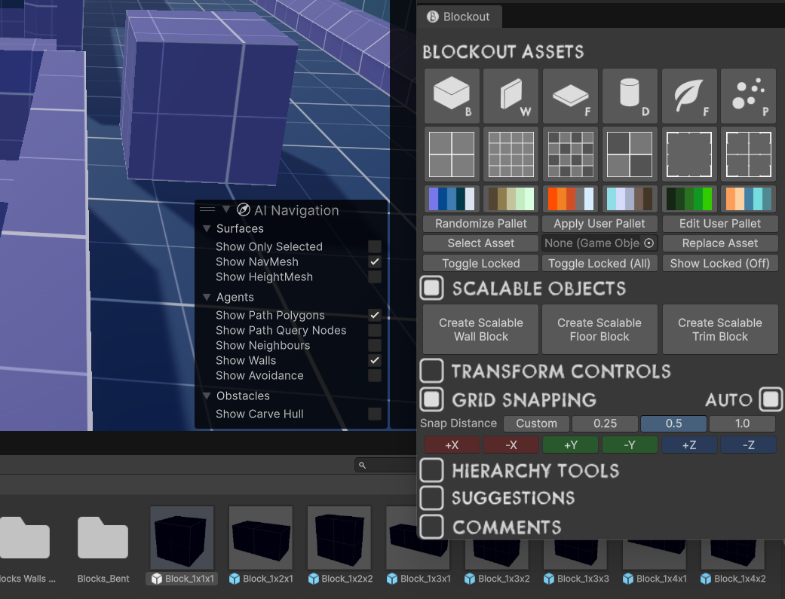

# 26booom3d
a 2026 booom project on painting the world red

以下内容供项目组成员确认进度，不是特别细致，爱来自FrogO2。

距离提交还有

天

## 基础能力
### 体型与基础移动

- 站立高度 1.5m，下蹲高度 0.5m，角色宽度约 0.6m。
- 行走速度 4m/s，冲刺速度 6m/s，蹲行速度 3m/s。
- 地面加速度 24m/s^2，减速度 20m/s^2。
- 空中仅有 60% 的水平加速度，但最高水平速度不变。

### 跳跃

- 常规跳跃高度 1.35m，起跳初速度约 6.36m/s，土狼跳 0.15s。
- 重力 15m/s^2。（这给我干哪来了这还是地球吗？）
- 玩家在落地前有一次二段跳的机会，登墙跑不会重置二段跳。（怎么让玩家意识到这一点？）

### 登墙跑与墙跳

- 登墙跑速度为 6m/s，只要有垂直于墙面的速度（不能直接登墙跳）就能无限次进入登墙跑，没有持续时间上限。
- 登墙跑时仍受 3m/s^2重力影响。
- 墙跳会保留原本的水平速度，并额外获得一个垂直墙面的离墙冲量和一个向上的冲量。玩家可以消耗二段跳在同一堵枪上再次登墙跑，几乎不会下降。但是如果只用墙跳的话一直向墙移动也需要下降约3m高度才能重回同一堵墙。
- 熟练的玩家可以在两堵相近的墙边（相对的垂直的都可以）不断重复登墙跑、跳并逐渐到达更高的地方。

### 下蹲与滑铲

- 玩家可以在空中下蹲，身高会压到 0.5m，且不会降低空中速度。这使玩家可以钻过较扁（最小0.5m，但是横向需要大于0.6m，见角色宽度）的空中缝隙。
- 如果玩家在空中按住冲刺和下蹲，并在落地时保持前进，会在落地后立刻进入滑铲。
- 滑铲是最快的（9m/s），但是只持续最多1秒，并且会不受地面角度影响地逐渐减速，玩家可以用跳跃打断。

## TODO
- 懒得写，请看策划书

## 规则怪谈
- 设计地图请考虑使用third parties文件夹下的blockout框架，但是不用也行。

- 如果新加代码或者模块出现红色警告，考虑点击左上角File->Build Profiles->Build and Run构建项目确认可以通过编译（记得把你的场景加入Scene List!）

- Git没办法合并场景文件修改。不要和别人使用同一场景文件，创建一个自己的Scene。

## Blockout入门

- 打开Window->Blockout->Editor启用Blockout界面 

- 如果没有如下界面就点最大的按钮 

- 建议使用0.5 Grid Snapping 

- 想创建大地板首选Scalable objects->Create Scalable Floor Block 然后拖动红色和绿色手柄 

- 其余使用最上面一排按钮然后直接将预制体拖进场景即可 

- 使用QWERT快速循环移动，缩放，旋转等工具，并查看Assets/ThirdParties/Blockout/Documentation.pdf阅读教程！
